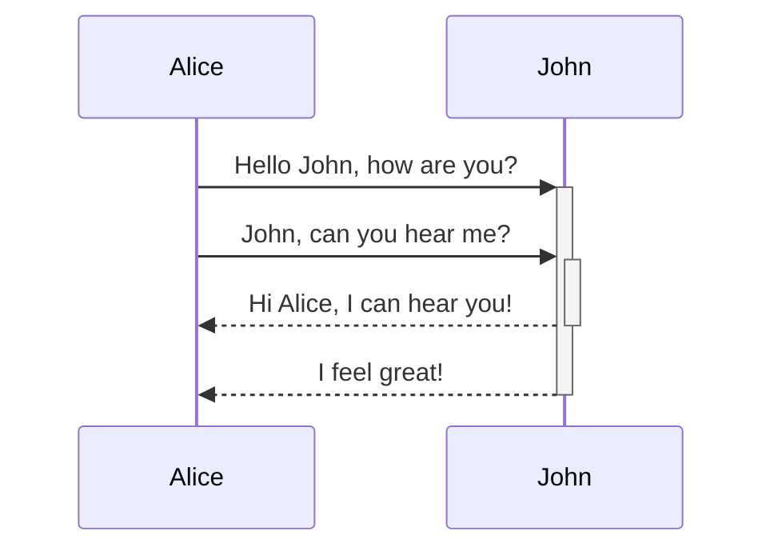
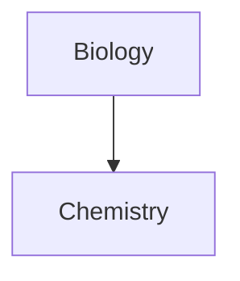

# Basic formatting syntax

Learn how to apply basic formatting to your notes, using [Markdown](https://daringfireball.net/projects/markdown/). For more advanced formatting syntax, refer to [Advanced formatting syntax](https://obsidian.md/help/advanced-syntax).

## Paragraphs 

To create paragraphs in Markdown, use a **blank line** to separate blocks of text. Each block of text separated by a blank line is treated as a distinct paragraph.

```md
This is a paragraph.

This is another paragraph.
```

This is a paragraph.

This is another paragraph.

A blank line between lines of text creates separate paragraphs. This is the default behavior in Markdown.

Multiple blank spaces

### Line breaks 

By default in Obsidian, pressing `Enter` once will create a new line in your note, but this is treated as a _continuation_ of the same paragraph in the rendered output, following typical Markdown behavior. To insert a line break _within_ a paragraph without starting a new paragraph, you can either:

- Add **two spaces** at the end of a line before pressing `Enter`, or
- Use the shortcut `Shift+Enter` to directly insert a line break.

Why don't multiple `Enter` presses create more line breaks in reading view?

Obsidian includes a **[Strict line breaks](https://obsidian.md/help/settings#Strict%20line%20breaks)** setting, which makes Obsidian follow the standard Markdown specification for line breaks.

To enable this feature:

1. Open **[Settings](https://obsidian.md/help/settings)**.
2. Go to the **Editor** tab.
3. Enable **Strict Line Breaks**.

When **Strict Line Breaks** is enabled in Obsidian, line breaks have three distinct behaviors depending on how the lines are separated:

**Single return with no spaces**: A single `Enter` with no trailing spaces will combine the two separate lines into a single line when rendered.

```md
line one
line two
```

Renders as:

line one line two

**Single return with two or more trailing spaces**: If you add two or more spaces at the end of the first line before pressing `Enter`, the two lines remain part of the same paragraph, but are broken by a line break (HTML `<br>` element). We'll use two underscores to stand in for spaces in this example.

```md
line three__  
line four
```

Renders as:

line three  
  
line four

**Double return (with or without trailing spaces)**: Pressing `Enter` twice (or more) separates the lines into two distinct paragraphs (HTML `<p>` elements), regardless of whether you add spaces at the end of the first line.

```md
line five

line six
```

Renders as:

line five

line six

## Headings 

To create a heading, add up to six `#` symbols before your heading text. The number of `#` symbols sets the level of the heading (as shown in the [Outline](https://obsidian.md/help/plugins/outline)).

```md
# This is a heading 1
## This is a heading 2
### This is a heading 3
#### This is a heading 4
##### This is a heading 5
###### This is a heading 6
```

# This is a heading 1

## This is a heading 2

### This is a heading 3

#### This is a heading 4

##### This is a heading 5

###### This is a heading 6

## Bold, italics, highlights 

Text formatting can also be applied using [Editing shortcuts](https://obsidian.md/help/editing-shortcuts).

|Style|Syntax|Example|Output|
|---|---|---|---|
|Bold|`** **` or `__ __`|`**Bold text**`|**Bold text**|
|Italic|`* *` or `_ _`|`*Italic text*`|_Italic text_|
|Strikethrough|`~~ ~~`|`~~Striked out text~~`|~~Striked out text~~|
|Highlight|`== ==`|`==Highlighted text==`|==Highlighted text==|
|Bold and nested italic|`** **` and `_ _`|`**Bold text and _nested italic_ text**`|**Bold text and _nested italic_ text**|
|Bold and italic|`*** ***` or `___ ___`|`***Bold and italic text***`|**_Bold and italic text_**|

Formatting can be forced to display in plain text by adding a backslash `\` in front of it.

**This line will not be bold**

```markdown
\*\*This line will not be bold\*\*
```

*_This line will be italic and show the asterisks_*

```markdown
\**This line will be italic and show the asterisks*\*
```

## Internal links 

Obsidian supports two formats for [internal links](https://obsidian.md/help/links) between notes:

- Wikilink: `[[Three laws of motion]]`
- Markdown: `[Three laws of motion](Three%20laws%20of%20motion.md)`

## External links 

If you want to link to an external URL, you can create an inline link by surrounding the link text in brackets (`[ ]`), and then the URL in parentheses (`( )`).

```md
[Obsidian Help](https://help.obsidian.md)
```

[Obsidian Help](https://help.obsidian.md/)

You can also create external links to files in other vaults, by linking to an [Obsidian URI](https://obsidian.md/help/uri).

```md
[Note](obsidian://open?vault=MainVault&file=Note.md)
```

### Escape blank spaces in links 

If your URL contains blank spaces, you must escape them by replacing them with `%20`.

```md
[My Note](obsidian://open?vault=MainVault&file=My%20Note.md)
```

You can also escape the URL by wrapping it with angled brackets (`< >`).

```md
[My Note](<obsidian://open?vault=MainVault&file=My Note.md>)
```

## External images 

You can add images with external URLs, by adding a `!` symbol before an [external link](https://obsidian.md/help/syntax#External%20links).

```md

```


You can change the image dimensions, by adding `|640x480` to the link destination, where 640 is the width and 480 is the height.

```md

```

If you only specify the width, the image scales according to its original aspect ratio. For example:

```md

```

Tip

## Quotes 

You can quote text by adding a `>` symbols before the text.

```md
> Human beings face ever more complex and urgent problems, and their effectiveness in dealing with these problems is a matter that is critical to the stability and continued progress of society.

\- Doug Engelbart, 1961
```

> Human beings face ever more complex and urgent problems, and their effectiveness in dealing with these problems is a matter that is critical to the stability and continued progress of society.

- Doug Engelbart, 1961

Tip

## Lists 

You can create an unordered list by adding a `-`, `*`, or `+` before the text.

```md
- First list item
- Second list item
- Third list item
```

- First list item
- Second list item
- Third list item

To create an ordered list, start each line with a number followed by a `.` or `)` symbol.

```md
1. First list item
2. Second list item
3. Third list item
```

1. First list item
2. Second list item
3. Third list item

```md
1) First list item
2) Second list item
3) Third list item
```

1. First list item
2. Second list item
3. Third list item

You can use `Shift+Enter` to insert a [line break](https://obsidian.md/help/syntax#Line%20breaks) within an ordered list without altering the numbering.

```md
1. First list item
   
2. Second list item
3. Third list item
   
4. Fourth list item
5. Fifth list item
6. Sixth list item
```

### Task lists 

To create a task list, start each list item with a hyphen and space followed by `[ ]`.

```md
- [x] This is a completed task.
- [ ] This is an incomplete task.
```

- [x] This is a completed task.
- [ ] This is an incomplete task.

You can toggle a task in Reading view by selecting the checkbox.

Tip

### Nesting lists 

You can nest any type of list—ordered, unordered, or task lists—under any other type of list.

To create a nested list, indent one or more list items. You can mix list types within a nested structure:

```md
1. First list item
   2. Ordered nested list item
3. Second list item
   - Unordered nested list item
```

1. First list item
    1. Ordered nested list item
2. Second list item
    - Unordered nested list item

Similarly, you can create a nested task list by indenting one or more list items:

```md
- [ ] Task item 1
	- [ ] Subtask 1
- [ ] Task item 2
	- [ ] Subtask 1
```

- [ ] Task item 1
    - [ ] Subtask 1
- [ ] Task item 2
    - [ ] Subtask 1

Use `Tab` or `Shift+Tab` to indent or unindent selected list items to easily organize them.

## Horizontal rule 

You can use three or more stars `***`, hyphens `---`, or underscore `___` on its own line to add a horizontal bar. You can also separate symbols using spaces.

```md
***
****
* * *
---
----
- - -
___
____
_ _ _
```

---

## Code 

You can format code both inline within a sentence, or in its own block.

### Inline code 

You can format code within a sentence using single backticks.

```md
Text inside `backticks` on a line will be formatted like code.
```

Text inside `backticks` on a line will be formatted like code.

If you want to put backticks in an inline code block, surround it with double backticks like so: inline ``code with a backtick ` inside``.

### Code blocks 

To format code as a block, enclose it with three or more backticks or three or more tildes.

``````
`````
cd ~/Desktop
`````
``````

```
~~~
cd ~/Desktop
~~~
```

```md
cd ~/Desktop
```

You can also create a code block by indenting the text using `Tab` or 4 blank spaces.

```md
    cd ~/Desktop
```

You can add syntax highlighting to a code block, by adding a language code after the first set of backticks.

``````md
`````js
function fancyAlert(arg) {
  if(arg) {
    $.facebox({div:'#foo'})
  }
}
`````
``````

```js
function fancyAlert(arg) {
  if(arg) {
    $.facebox({div:'#foo'})
  }
}
```

Obsidian uses Prism for syntax highlighting. For more information, refer to [Supported languages](https://prismjs.com/#supported-languages).

PrismJS and editing views

[Source mode](https://obsidian.md/help/edit-and-read#Source%20mode) and [Live Preview](https://obsidian.md/help/edit-and-read#Live%20Preview) do not support PrismJS, and may render syntax highlighting differently.

#### Nesting code blocks 

When you need to include a code block inside another code block (for example, when documenting how to use code blocks), you can use more than three backticks or tildes for the outer code block.

To nest code blocks, use four or more backticks (or tildes) for the outer block, while the inner block uses three:

`````md
````md
Here's how to create a code block:
```js
console.log("Hello world")
```
````
`````

You can also mix backticks and tildes. This is particularly useful when working with code that generates other code blocks:

`````md
````md
```dataviewjs
dv.paragraph(`
~~~mermaid
graph TD
    A --> B
~~~
`)
```
````
`````

The key principle is that the outer code block must use **more** fence characters (backticks or tildes) than any inner code block, or use a different fence character type.

## Footnotes 

You can add footnotes[[1]](https://publish.obsidian.md/#fn-1-383cd42c5a4c7fb6) to your notes using the following syntax:

```md
This is a simple footnote[^1].

[^1]: This is the referenced text.
[^2]: Add 2 spaces at the start of each new line.
  This lets you write footnotes that span multiple lines.
[^note]: Named footnotes still appear as numbers, but can make it easier to identify and link references.
```

You can also inline footnotes in a sentence. Note that the caret goes outside the brackets.

```md
You can also use inline footnotes. ^[This is an inline footnote.]
```

Note

Inline footnotes only work in reading view, not in Live Preview.

## Comments 

You can add comments by wrapping text with `%%`. Comments are only visible in Editing view.

```md
This is an %%inline%% comment.

%%
This is a block comment.

Block comments can span multiple lines.
%%
```

## Escaping Markdown Syntax 

In some cases, you may need to display special characters in Markdown, such as `*`, `_`, or `#`, without triggering their formatting. To display these characters literally, place a backslash (`\`) before them.

Common characters to escape

- Asterisk: `\*`
- Underscore: `\_`
- Hashtag: `\#`
- Backtick: `` \` ``
- Pipe (used in tables): `\|`
- Tilde: `\~`

```md
\*This text will not be italicized\*.
```

*This text will not be italicized*.

When working with numbered lists, you may need to escape the period after the number to prevent automatic list formatting. Place the backslash (`\`) before the period, **not** before the number.

```md
1\. This won't be a list item.
```

1. This won't be a list item.

## Learn more 

To learn more advanced formatting syntax, such as tables, diagrams, and math expressions, refer to [Advanced formatting syntax](https://obsidian.md/help/advanced-syntax).

To learn more about how Obsidian parses Markdown, refer to [Obsidian Flavored Markdown](https://obsidian.md/help/obsidian-flavored-markdown).

---

1. This is a footnote.[↩︎](https://publish.obsidian.md/#fnref-1-383cd42c5a4c7fb6)


# Advanced formatting syntax

Learn how to add advanced formatting syntax to your notes.

## Tables 

You can create tables using vertical bars (`|`) to separate columns and hyphens (`-`) to define headers. Here's an example:

```md
| First name | Last name |
| ---------- | --------- |
| Max        | Planck    |
| Marie      | Curie     |
```

|First name|Last name|
|---|---|
|Max|Planck|
|Marie|Curie|

While the vertical bars on either side of the table are optional, including them is recommended for readability.

In _Live Preview_, you can right-click a table to add or delete columns and rows. You can also sort and move them using the context menu.

You can insert a table using the **Insert Table** command from the [Command Palette](https://obsidian.md/help/plugins/command-palette) or by right-clicking and selecting _Insert → Table_. This will give you a basic, editable table:

```md
|     |     |
| --- | --- |
|     |     |
```

Note that cells don't need perfect alignment, but the header row must contain at least two hyphens:

```md
First name | Last name
-- | --
Max | Planck
Marie | Curie
```

### Format content within a table 

You can use [basic formatting syntax](https://obsidian.md/help/syntax) to style content within a table.

|First column|Second column|
|---|---|
|[Internal links](https://obsidian.md/help/links)|Link to a file _within_ your **vault**.|
|[Embed files](https://obsidian.md/help/embeds)||

Vertical bars in tables

If you want to use [aliases](https://obsidian.md/help/aliases), or to [resize an image](https://obsidian.md/help/syntax#External%20images) in your table, you need to add a `\` before the vertical bar.

```md
First column | Second column
-- | --
[[Basic formatting syntax\|Markdown syntax]] | ![[Engelbart.jpg\|200]]
```

|First column|Second column|
|---|---|
|[Markdown syntax](https://obsidian.md/help/syntax)||

Align text in columns by adding colons (`:`) to the header row. You can also align content in _Live Preview_ via the context menu.

```md
Left-aligned text | Center-aligned text | Right-aligned text
:-- | :--: | --:
Content | Content | Content
```

|Left-aligned text|Center-aligned text|Right-aligned text|
|:--|:-:|--:|
|Content|Content|Content|

## Diagram 

You can add diagrams and charts to your notes, using [Mermaid](https://mermaid-js.github.io/). Mermaid supports a range of diagrams, such as [flow charts](https://mermaid.js.org/syntax/flowchart.html), [sequence diagrams](https://mermaid.js.org/syntax/sequenceDiagram.html), and [timelines](https://mermaid.js.org/syntax/timeline.html).

Tip

You can also try Mermaid's [Live Editor](https://mermaid-js.github.io/mermaid-live-editor) to help you build diagrams before you include them in your notes.

To add a Mermaid diagram, create a `mermaid` [code block](https://obsidian.md/help/syntax#Code%20blocks).

````md

````

JohnAliceJohnAliceHello John, how are you?John, can you hear me?Hi Alice, I can hear you!I feel great!

````md

````

### Linking files in a diagram 

You can create [internal links](https://obsidian.md/help/links) in your diagrams by attaching the `internal-link` [class](https://mermaid.js.org/syntax/flowchart.html#classes) to your nodes.

````md

````

Note

Internal links from diagrams don't show up in the [Graph view](https://obsidian.md/help/plugins/graph).

If you have many nodes in your diagrams, you can use the following snippet.

````md

````

This way, each letter node becomes an internal link, with the [node text](https://mermaid.js.org/syntax/flowchart.html#a-node-with-text) as the link text.

Note

If you use special characters in your note names, you need to put the note name in double quotes.

```
class "⨳ special character" internal-link
```

Or, `A["⨳ special character"]`.

For more information about creating diagrams, refer to the [official Mermaid docs](https://mermaid.js.org/intro/).

## Math 

You can add math expressions to your notes using [MathJax](http://docs.mathjax.org/en/latest/basic/mathjax.html) and the LaTeX notation.

To add a MathJax expression to your note, surround it with double dollar signs (`$$`).

```md
$$
\begin{vmatrix}a & b\\
c & d
\end{vmatrix}=ad-bc
$$
```

You can also inline math expressions by wrapping it in `$` symbols.

```md
This is an inline math expression $e^{2i\pi} = 1$.
```

This is an inline math expression .

For more information about the syntax, refer to [MathJax basic tutorial and quick reference](https://math.meta.stackexchange.com/questions/5020/mathjax-basic-tutorial-and-quick-reference).

For a list of supported MathJax packages, refer to [The TeX/LaTeX Extension List](http://docs.mathjax.org/en/latest/input/tex/extensions/index.html).


# Obsidian Flavored Markdown

Obsidian strives for maximum capability without breaking any existing formats. As a result, we use a combination of flavors of [Markdown](https://obsidian.md/help/syntax).

Obsidian supports [CommonMark](https://commonmark.org/), [GitHub Flavored Markdown](https://github.github.com/gfm/), and [LaTeX](https://www.latex-project.org/).

Markdown inside HTML

### Supported Markdown extensions 

|Syntax|Description|
|---|---|
|`[[Link]]`|[Internal links](https://obsidian.md/help/links)|
|`![[Link]]`|[Embed files](https://obsidian.md/help/embeds)|
|`![[Link#^id]]`|[Block references](https://obsidian.md/help/links#Link%20to%20a%20block%20in%20a%20note)|
|`^id`|[Defining a block](https://obsidian.md/help/links#Link%20to%20a%20block%20in%20a%20note)|
|`[^id]`|[Footnotes](https://obsidian.md/help/syntax#Footnotes)|
|`%%Text%%`|[Comments](https://obsidian.md/help/syntax#Comments)|
|`~~Text~~`|[Strikethroughs](https://obsidian.md/help/syntax#Bold,%20italics,%20highlights)|
|`==Text==`|[Highlights](https://obsidian.md/help/syntax#Bold,%20italics,%20highlights)|
|` ``` `|[Code blocks](https://obsidian.md/help/syntax#Code%20blocks)|
|`- [ ]`|[Incomplete task](https://obsidian.md/help/syntax#Task%20lists)|
|`- [x]`|[Completed task](https://obsidian.md/help/syntax#Task%20lists)|
|`> [!note]`|[Callouts](https://obsidian.md/help/callouts)|
|(see link)|[Tables](https://obsidian.md/help/advanced-syntax#Tables)|

# Attachments

You can import [Accepted file formats](https://obsidian.md/help/file-formats), or _attachments_, to your vault, such as images, audio files, or PDFs. Attachments are regular files that you can access using your file system. Attachments can be [embedded](https://obsidian.md/help/embeds).

## Add an attachment 

You can add attachments to your vault in multiple ways. Only [Accepted file formats](https://obsidian.md/help/file-formats) can be added.

Copy and paste attachments

Drag and drop attachments

Download attachments to vault folder

## Change default attachment location 

By default, attachments are added to the root of your vault.

You can change the default attachment location under **[Settings](https://obsidian.md/help/settings) → Files & Links → Default location for new attachments**.

- **Vault folder** adds the attachment to the root of your vault.
- **In the folder specified below** adds the attachment to a specified folder.
- **Same folder as current file** adds the attachment to the same folder as the note you added it to.
- **In subfolder under current folder** adds attachments to a specified folder next to the note you added the attachment to. If it doesn't exist, Obsidian creates it when you add an attachment.


## Callouts

### Supported types 

You can use several callout types and aliases. Each type comes with a different background color and icon.

To use these default styles, replace `info` in the examples with any of these types, such as `[!tip]` or `[!warning]`. Callout types can also be changed by right-clicking a callout in Live Preview mode.

Unless you [Customize callouts](https://obsidian.md/help/callouts#Customize%20callouts), any unsupported type defaults to the `note` type. The type identifier is case-insensitive.

Note

> [!note]
> Lorem ipsum dolor sit amet

---

> [!abstract]
> Lorem ipsum dolor sit amet

Aliases: `summary`, `tldr`

---

> [!info]
> Lorem ipsum dolor sit amet

---

> [!todo]
> Lorem ipsum dolor sit amet

---

> [!tip]
> Lorem ipsum dolor sit amet

Aliases: `hint`, `important`

---

> [!success]
> Lorem ipsum dolor sit amet

Aliases: `check`, `done`

---

> [!question]
> Lorem ipsum dolor sit amet

Aliases: `help`, `faq`

---

> [!warning]
> Lorem ipsum dolor sit amet

Aliases: `caution`, `attention`

---

> [!failure]
> Lorem ipsum dolor sit amet

Aliases: `fail`, `missing`

---

> [!danger]
> Lorem ipsum dolor sit amet

Alias: `error`

---

> [!bug]
> Lorem ipsum dolor sit amet

---

> [!example]
> Lorem ipsum dolor sit amet

---

> [!quote]
> Lorem ipsum dolor sit amet

Alias: `cite`


# Editing shortcuts

This page lists default keyboard shortcuts for navigating and editing text in Obsidian. These shortcuts are provided by your operating system or the framework Obsidian is built on, and cannot be customized within Obsidian.

For customizable keyboard shortcuts for Obsidian commands, see [Hotkeys](https://obsidian.md/help/hotkeys).

## Windows and Linux shortcuts 

### Common actions 

|Action|Shortcut|
|---|---|
|Copy|`Ctrl+C`|
|Cut|`Ctrl+X`|
|Paste|`Ctrl+V`|
|Paste without formatting|`Ctrl+Shift+V`|
|Undo|`Ctrl+Z`|
|Redo|`Ctrl+Shift+Z` or `Ctrl+Y`|
|Copy paragraph|`Ctrl+C` (with no selected text)|
|Cut paragraph|`Ctrl+X` (with no selected text)|

### Text editing 

|Action|Shortcut|
|---|---|
|Insert new line|`Enter`|
|Delete the previous character|`Backspace`|
|Delete the next character|`Delete`|
|Delete the previous word|`Ctrl+Backspace`|
|Delete the next word|`Ctrl+Delete`|
|Delete the current line|`Ctrl+Shift+K` (with no selected text)|

### Text navigation 

|Action|Shortcut|
|---|---|
|Move the cursor one character|`Left/→`|
|Move the cursor to the beginning of the previous word|`Ctrl+←`|
|Move the cursor to the end of the next word|`Ctrl+→`|
|Move the cursor to the beginning of the current line|`Home`|
|Move the cursor to the end of the current line|`End`|
|Move the cursor to the previous line|`↑`|
|Move the cursor to the next line|`↓`|
|Move the cursor to the beginning of the note|`Ctrl+Home`|
|Move the cursor to the end of the note|`Ctrl+End`|
|Move the cursor up one page|`Page up`|
|Move the cursor down one page|`Page down`|

### Text selection 

|Action|Shortcut|
|---|---|
|Simplify selection|`Escape`|
|Select all|`Ctrl+A`|
|Extend selection one character|`Shift+Left/→`|
|Extend selection to the beginning of the previous word|`Ctrl+Shift+←`|
|Extend selection to the end of the next word|`Ctrl+Shift+→`|
|Extend selection to the beginning of the current line|`Shift+Home`|
|Extend selection to the end of the current line|`Shift+End`|
|Extend selection to the beginning of the note|`Ctrl+Shift+Home`|
|Extend selection to the end of the note|`Ctrl+Shift+End`|
|Extend selection one page up|`Shift+Page up`|
|Extend selection one page down|`Shift+Page down`|

## macOS shortcuts 

### Common actions 

|Action|Shortcut|
|---|---|
|Copy|`Cmd+C`|
|Cut|`Cmd+X`|
|Paste|`Cmd+V`|
|Paste without formatting|`Cmd+Shift+V`|
|Undo|`Cmd+Z`|
|Redo|`Cmd+Shift+Z`|
|Copy paragraph|`Cmd+C` (with no selected text)|
|Cut paragraph|`Cmd+X` (with no selected text)|

### Text formatting 

|Action|Shortcut|
|---|---|
|Bold text|`Cmd+B`|
|Italic text|`Cmd+I`|

### Text editing 

|Action|Shortcut|
|---|---|
|Insert new line|`Enter`|
|Delete the previous character|`Backspace`|
|Delete the next character|`Delete`|
|Delete the previous word|`Option+Backspace`|
|Delete the next word|`Option+Delete`|
|Delete to the beginning of the current line|`Cmd+Backspace`|
|Delete to the end of the current line|`Cmd+Delete`|
|Delete the current line|`Cmd+Shift+K` (with no selected text)|

### Text navigation 

|Action|Shortcut|
|---|---|
|Move the cursor one character|`Left/→`|
|Move the cursor to the beginning of the previous word|`Option+←`|
|Move the cursor to the end of the next word|`Option+→`|
|Move the cursor to the beginning of the current line|`Cmd+←`|
|Move the cursor to the end of the current line|`Cmd+→`|
|Move the cursor to the previous line|`↑`|
|Move the cursor to the next line|`↓`|
|Move the cursor to the beginning of the note|`Cmd+↑`|
|Move the cursor to the end of the note|`Cmd+↓`|
|Move the cursor up one page|`Fn+↑`|
|Move the cursor down one page|`Fn+↓`|

### Text selection 

|Action|Shortcut|
|---|---|
|Simplify selection|`Escape`|
|Select all|`Cmd+A`|
|Extend selection one character|`Shift+Left/→`|
|Extend selection to the beginning of the previous word|`Option+Shift+←`|
|Extend selection to the end of the next word|`Option+Shift+→`|
|Extend selection to the beginning of the current line|`Cmd+Shift+←`|
|Extend selection to the end of the current line|`Cmd+Shift+→`|
|Extend selection to the beginning of the note|`Cmd+Shift+↑`|
|Extend selection to the end of the note|`Cmd+Shift+↓`|
|Extend selection one page up|`Ctrl+Shift+↑`|
|Extend selection one page down|`Ctrl+Shift+↓`|


# Embed web pages

Learn how to use the [iframe](https://developer.mozilla.org/en-US/docs/Web/HTML/Element/iframe) HTML element to embed web pages in your notes.

To embed a web page, add the following in your note and replace the placeholder text with the URL of the web page you want to embed:

```html
<iframe src="INSERT YOUR URL HERE"></iframe>
```

Note

Some websites don't allow you to embed them. Instead, they may provide URLs that are meant for embedding them. If the website doesn't support embedding, try searching for the name of the website followed by "embed iframe". For example, "youtube embed iframe".

Tip

If you're using [Canvas](https://obsidian.md/help/plugins/canvas), you can embed a web page in a card. For more information, refer to [Canvas > Add cards from web pages](https://obsidian.md/help/plugins/canvas#Add%20cards%20from%20web%20pages).

## Embed a YouTube video 

To embed a YouTube video, use the same Markdown syntax as [external images](https://obsidian.md/help/syntax#External%20images):


## Embed a tweet 

To embed a tweet, use the same Markdown syntax as [external images](https://obsidian.md/help/syntax#External%20images):


# HTML content

Obsidian supports HTML to allow you to display your notes the way you want, or even [embed web pages](https://obsidian.md/help/embed-web-pages). Allowing HTML inside your notes comes with risks. To prevent malicious code from doing harm, Obsidian _sanitizes_ any HTML in your notes.

Example

The `<script>` element normally lets you run JavaScript whenever it loads. If Obsidian didn't sanitize HTML, an attacker could convince you to paste a text containing JavaScript that extracts sensitive information from your computer and sends it back to them.

That said, since Markdown syntax does not support all forms of styling, using sanitized HTML can be yet another way of enhancing the quality of your notes. We've included some of the more common usages of HTML.

## HTML limitations 

Obsidian has specific limitations when using HTML in your notes:

### No Markdown inside HTML 

Obsidian does not render Markdown syntax inside HTML elements. This is an intentional design choice for performance optimization and to keep parser complexity low when managing large documents.

For example, this will not work as expected:

<div>
This **will not** be bold and this `will not` be code.
</div>

### HTML blocks must be self-contained 

HTML blocks must be complete and cannot contain blank lines within them. Blank lines will break the HTML block.

This will work:

<table>
<tr>
<td>Content here</td>
</tr>
</table>

This will not work correctly:

<table>

<tr>

<td>Content here</td>

</tr>

</table>

### When Markdown appears to work in HTML 

Some inline HTML tags like `<span>` or `<a>` have limited functionality and may appear to render Markdown, but this is not actually what's happening. The Markdown is being processed outside of the HTML context.

For more details on how Obsidian handles Markdown, see [Obsidian Flavored Markdown](https://obsidian.md/help/obsidian-flavored-markdown).

## Common HTML usage 

More details on using `<iframe>` can be found in [Embed web pages](https://obsidian.md/help/embed-web-pages).

### Comments 

[Markdown comments](https://obsidian.md/help/syntax#Comments) are the preferred way of adding hidden comments within your notes. However some methods of converting Markdown notes, such as [Pandoc](https://pandoc.org/), have limited support of Markdown comments. In those instances, you can use a `<!-- HTML Comment -->` instead!

### Underline 

If you need to quickly underline an item in your notes, you can use `<u>Example</u>` to create your underlined text.

### Span/Div 

Span and div tags can be used to apply custom classes from a [CSS snippet](https://obsidian.md/help/snippets), or custom defined styling, onto a selected area of text. For example, using `<span style="font-family: cursive">your text</span>` can allow you to quickly change your font.

## Strikethrough 

Need to strike ~~some text~~? Use `<s>this</s>` to strike it out.


# Internal links

Learn how to link to notes, attachments, and other files from your notes, using _internal links_. By linking notes, you can create a network of knowledge.

Obsidian can automatically update internal links in your vault when you rename a file. If you want to be prompted instead, you can disable it under:

**[Settings](https://obsidian.md/help/settings)** → **[Files and links](https://obsidian.md/help/settings#Files%20and%20links)** → **[Automatically update internal links](https://obsidian.md/help/settings#Automatically%20update%20internal%20links)**.

## Supported formats for internal links 

Obsidian supports the following link formats:

- Wikilink: `[[Three laws of motion]]` or `[[Three laws of motion.md]]`
- Markdown: `[Three laws of motion](Three%20laws%20of%20motion)` or `[Three laws of motion](Three%20laws%20of%20motion.md)`

The examples above are equivalent, and they appear the same way in the editor and links to the same note.

Note

When using the Markdown format, make sure to [URL encode](https://en.wikipedia.org/wiki/Percent-encoding) the link destination. For example, blank spaces become `%20`.

By default, due to its more compact format, Obsidian generates links using the Wikilink format. If interoperability is important to you, you can disable Wikilinks and use Markdown links instead.

To use the Markdown format:

1. Open **[Settings](https://obsidian.md/help/settings)**.
2. Under **Files and Links**, disable **Use [[Wikilinks]]**.

Even if you disable the Wikilink format, you can still autocomplete links by typing two square brackets `[[`. When you select one of the suggested files, Obsidian instead generates a Markdown link.

Invalid characters

A string which contains the following characters may not work as a link: `# | ^ : %% [[ ]]`.

We recommend avoiding using those characters and practicing [safe filename practices](https://stackoverflow.com/questions/1976007/what-characters-are-forbidden-in-windows-and-linux-directory-names).

## Link to a file 

To create a link while in Editing view, use either of the following ways:

- Type `[[` in the editor and then select the file you want to create a link to.
- Select text in the editor and then type `[[`.
- Open the [Command palette](https://obsidian.md/help/plugins/command-palette) and then select Add internal link.

Info

Autocomplete functionality switches to a simpler result algorithm when the vault reaches 10,000 items to maintain optimal application performance.  

While you can link to any of the [Accepted file formats](https://obsidian.md/help/file-formats), links to file formats other than Markdown needs to include a file extension, such as `[[Figure 1.png]]`.

Prefixing an internal link with an exclamation mark (!) allows you to embed the linked content. For more details, see [Embed Files](https://obsidian.md/help/embeds).

Excluded files

Files matching your [Excluded files](https://obsidian.md/help/settings#Excluded%20files) patterns are deprioritized in link suggestions when creating internal links.

## Link to a heading in a note 

You can link to specific headings in notes, also known as _anchor links_.

**Linking to a heading within the same note**

To link to a heading within the same note, type `[[#` to get a list of headings within the note to link to.

For example, `[[#Preview a linked file]]` will create a link to [Preview a linked file](https://obsidian.md/help/links#Preview%20a%20linked%20file).

**Linking to a heading in another note**

To link to a heading in another note, add a hash (`#`) at the end of the link destination, followed by the heading text.

For example, `[[About Obsidian#Links are first-class citizens]]` will create a link to [About Obsidian > Links are first-class citizens](https://obsidian.md/help/obsidian#Links%20are%20first-class%20citizens).

**Linking to subheadings**

You can add multiple hash symbols for each subheading.

For example, `[[Help and support#Questions and advice#Report bugs and request features]]` will create a link to [Help and support > Questions and advice > Report bugs and request features](https://obsidian.md/help/resources#Questions%20and%20advice#Report%20bugs%20and%20request%20features).

**Searching for headers across the vault**

To search for headers across the entire vault, use the `[[## header]]` syntax.

For example, `[[##` will search generically across the vault, whereas `[[## team]]` will search for all headers that contain the word _team_.

Screenshot of searching for a heading link

## Link to a block in a note 

A block is a unit of text in your note, such as a paragraph, block quote, or list item.

You can link to a block by adding `#^` at the end of your link destination, followed by a unique block identifier. For example: `[[2023-01-01#^37066d]]`. Fortunately, you don't need to manually find the identifier—when you type the caret (`^`), a list of suggestions will appear, allowing you to select the correct block.

For _simple paragraphs_, place a blank space followed by a caret `^` and the block identifier at the end of the line:

```md
The quick purple gem dashes through the paragraph with blazing speed. Pen in hand and a paperclip in the other, Gemmy works toward her goal of making the world of note-taking a happier place. ^37066d
```

For _structured blocks_ (lists, quotations, callouts, tables), the block identifier should be on a separate line, with a blank line before and after:

```md
> The quick purple gem dashes through the paragraph with blazing speed. Pen in hand and a paperclip in the other, Gemmy works toward her goal of making the world of note-taking a happier place.

^37066f

This is the tale of Gemmy, the Unhelpful assistant.  
```

For _specific lines within a list_, the block identifier can be placed directly on a bullet point:

```mathjax
- Gemmy
    $$Paperclip / Pen$$ 
    ^37006f
- Unhelpful assistant
```

We do not support links to specific parts of quotations, callouts, and tables.

**Searching for blocks across the vault**

You can also search for blocks to link to from across your vault using the `[[^^block]]` syntax. However, more items qualify as blocks compared to [heading links](https://obsidian.md/help/links#Link%20to%20a%20heading%20in%20a%20note), so this list will be much longer.

Screenshot of searching for a block link

You can also create human-readable block identifiers by adding a blank space followed by a caret (`^`) and the identifier. Block identifiers can only consist of Latin letters, numbers, and dashes.

For example, add `^quote-of-the-day` at the end of a block:

```md
"You do not rise to the level of your goals. You fall to the level of your systems." by James Clear ^quote-of-the-day
```

Now you can link to the block by typing `[[2023-01-01#^quote-of-the-day]]`.

Interoperability

Block references are specific to Obsidian and not part of the standard Markdown format. Links containing block references won't work outside of Obsidian.

## Change the link display text 

By default, Obsidian will show the link text as it appears. For example:

- `[[Example]]` displays as [Example](https://obsidian.md/help/Example)
- `[[Example#Details]]` displays as [Example > Details](https://obsidian.md/help/Example#Details)

You can change how a link is displayed by customizing its link text:

**Wikilink format**:  
Use a vertical bar (`|`) to change the display text.

- `[[Example|Custom name]]` appears as [Custom name](https://obsidian.md/help/Example)
- `[[Example#Details|Section name]]` appears as [Section name](https://obsidian.md/help/Example#Details)

**Markdown format**:  
Use `[Display text](Link URL)` to customize how the link appears.

- `[Custom name](Example.md)` appears as [Custom name](https://obsidian.md/help/Example)
- `[Section name](Example.md#Details)` appears as [Section name](https://obsidian.md/help/Example#Details)

This method is helpful for one-off situations where you want to change how a link looks in a specific context. If you want to set up an alternate link name that you can reuse throughout your vault, consider using an [alias](https://obsidian.md/help/aliases) instead.

For example, if you regularly refer to `[[Three laws of motion]]` as `[[The 3 laws]]`, adding "3 laws" as an alias lets you type just that — no need to add custom display text each time.

Tip

Use [link display text](https://obsidian.md/help/links#Change%20the%20link%20display%20text) when you want to customize how a link looks _in a specific place_.  

Use [aliases](https://obsidian.md/help/aliases) when you want to refer to the same note using _different names_ throughout your vault.  

## Preview a linked file 

Note

To preview linked files, you first need to enable [Page preview](https://obsidian.md/help/plugins/page-preview).

To preview a linked file, hover over an internal link. While in editing mode, press `Ctrl` (or `Cmd` on macOS) while hovering the cursor over the link. A preview of the file content appears next to the cursor.


# Aliases

If you want to reference a file using different names, consider adding _aliases_ to the note. An alias is an alternative name for a note.

Use aliases for things like acronyms, nicknames, or to refer to a note in a different language.

If you're only trying to change how a link looks in one place, see how to [Change the link display text](https://obsidian.md/help/links#Change%20the%20link%20display%20text) instead.

Tip

Use [link display text](https://obsidian.md/help/links#Change%20the%20link%20display%20text) when you want to customize how a link looks _in a specific place_.  

Use [aliases](https://obsidian.md/help/aliases) when you want to refer to the same note using _different names_ throughout your vault.  

## Add an alias to a note 

To add an alias for a note, add `aliases` property in the note [Properties](https://obsidian.md/help/properties). Aliases should always be formatted as a list in YAML.

```md
---
aliases:
  - Doggo
  - Woofer
  - Yapper
---

# Dog
```

## Link to a note using an alias 

To link to a note using an alias:

1. Start typing the alias in an [internal link](https://obsidian.md/help/links). Any alias shows up in the list of suggestions, with a curved arrow icon next to it.
2. Press `Enter` to select the alias.

Obsidian creates the link with the alias as its custom display text, for example `[[Artificial Intelligence|AI]]`.

Note

Rather than just using the alias as the link destination (`[[AI]]`), Obsidian uses the `[[Artificial Intelligence|AI]]` link format to ensure interoperability with other applications using the Wikilink format.

## Find unlinked mentions for an alias 

By using [Backlinks](https://obsidian.md/help/plugins/backlinks), you can find unlinked mentions of aliases.

For example, after setting "AI" as an alias for "Artificial intelligence", you can see mentions of "AI" in other notes.

If you link an unlinked mention to an alias, Obsidian turns the mention into an [internal link](https://obsidian.md/help/links) with the alias as its display text.


# Embed files

Learn how you can embed other notes and media into your notes. By embedding files in your notes, you can reuse content across your vault.

To embed a file in your vault, add an exclamation mark (`!`) in front of an [Internal link](https://obsidian.md/help/links). You can embed files in any of the [Accepted file formats](https://obsidian.md/help/file-formats).

Drag and Drop embed

On desktop, you can also drag and drop supported files directly into your note to embed them automatically.

## Embed a note in another note 

To embed a note:

```md
![[Internal links]]
```

You can also embed links to [headings](https://obsidian.md/help/links#Link%20to%20a%20heading%20in%20a%20note) and [blocks](https://obsidian.md/help/links#Link%20to%20a%20block%20in%20a%20note).

```md
![[Internal links#^b15695]]
```

The text below is an example of an embedded block:

Learn how to link to notes, attachments, and other files from your notes, using _internal links_. By linking notes, you can create a network of knowledge.

## Embed an image in a note 

To embed an image:

```md
![[Engelbart.jpg]]
```


You can change the image dimensions, by adding `|640x480` to the link destination, where 640 is the width and 480 is the height.

```md
![[Engelbart.jpg|100x145]]
```

If you only specify the width, the image scales according to its original aspect ratio. For example, `![[Engelbart.jpg|100]]`.


You can also embed an externally hosted image by using a markdown link. You can control the width and height the same way as a wikilink.

```md

```


## Embed an audio file in a note 

To embed an audio file:

```md
![[Excerpt from Mother of All Demos (1968).ogg]]
```

## Embed a PDF in a note 

To embed a PDF:

```md
![[Document.pdf]]
```

You can also open a specific page in the PDF, by adding `#page=N` to the link destination, where `N` is the number of the page:

```md
![[Document.pdf#page=3]]
```

You can also specify the height in pixels for the embedded PDF viewer, by adding `#height=[number]` to the link. For example:

```md
![[Document.pdf#height=400]]
```

## Embed a list in a note 

To embed a list from a different note, first add a [block identifier](https://obsidian.md/help/links#Link%20to%20a%20block%20in%20a%20note) to your list:

```md

- list item 1
- list item 2

^my-list-id
```

Then link to the list using the block identifier:

```md
![[My note#^my-list-id]]
```

## Embed search results 

## Embed search results in a note 

To embed search results in a note, add a `query` code block:

````
```query
embed OR search
```
````

[Obsidian Publish](https://obsidian.md/help/publish) doesn't support embedded [search results](https://obsidian.md/help/publish/limitations#Search). To see a live rendered example, use the code block above within your vault.


